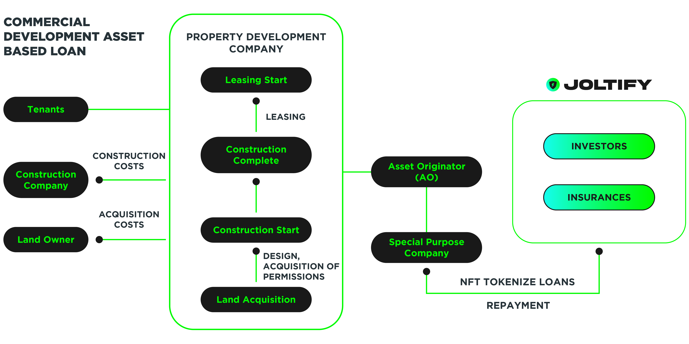

# A Commercial Development Asset-Based Loan Within The JOLTIFY network

The diagram below showcases how a property development company can secure a commercial development asset-based loan within JOLTIFY.

The Property development company is in charge of the whole process of this commercial property development from land acquisition to construction, leasing etc. The asset originator will set up a special purpose vehicle company. The purpose of a special purpose vehicle is to separate the loans from the other obligations that it has securities in. This SPV, therefore, allows its investors to receive monetary benefits before any other debtors or stakeholders of the company.

SPV will use the JOLTIFY platform to tokenize NFT using loans as collateral and get access to the fund liquidity in the JOLTIFY from JOLTIFY investors. During the loan's lifetime, the SPV company will pay the interest rates by the scheduled time and buy back the NFT when the loan ends.

