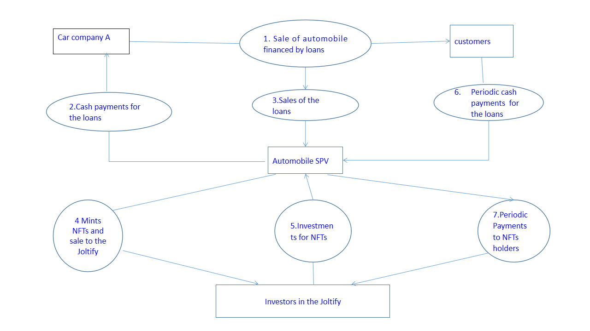

# Cash Flow-Based Loan In Joltify To Help A Car Company Grow Its Business

The following example shows how a car company can work with JOLTIFY to expand its business.

Let's use the example of a Car Dealership that sells 1,000 cars p/a with an average car price of $20,000. This means they would have distributed $20m in car loans.&#x20;

Currently, credit agencies evaluate the collateral, they then look into the customers the credit history and risk of the loan default, which helps them ascertain the loan interest rate.&#x20;

Once collaterals are understood, they can then be minted into NFT's and sold to investors within the JOLTIFY network, with detailed disclosure about the collateral (the car loan).

