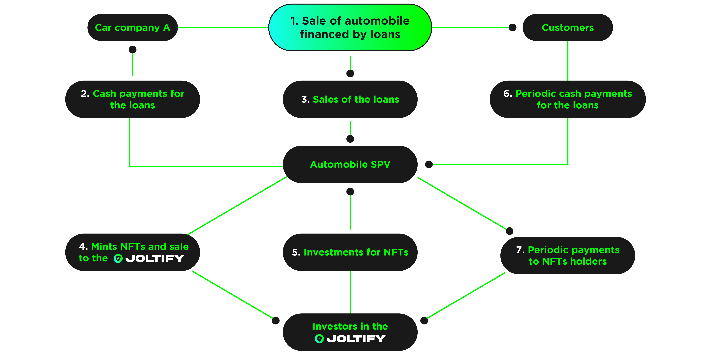

# Cash Flow-Based Loan In JOLTIFY To Help A Car Company Grow Its Business

The following example shows how a car company can work with JOLTIFY to expand its business.

Let's use the example of a Car Dealership that sells 1,000 cars p/a with an average car price of $20,000. This means they would have distributed $20m in car loans.

Currently, credit agencies evaluate the collateral, they then look into the customer's credit history and risk of the loan default, which helps them ascertain the loan interest rate.

Once collaterals are understood, they can then be minted into NFTs and sold to investors within the JOLTIFY network, with detailed disclosure about the collateral (the car loan).
