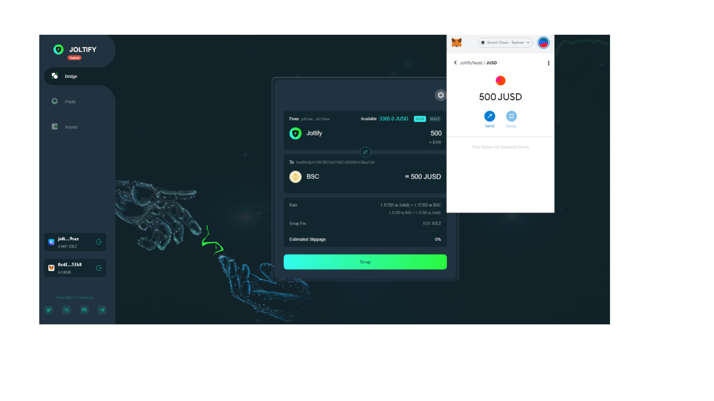
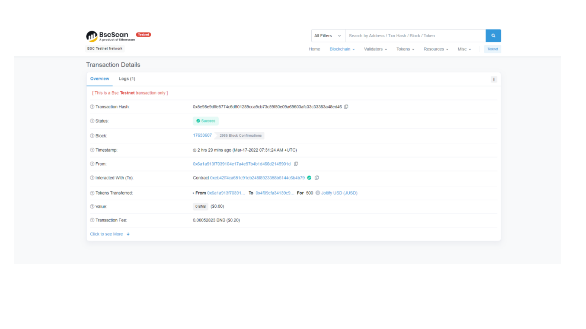

# Check The Transaction Information At BNB Smart Chain Testnet Explorer

**We just transferred 500 JUSDs from Joltify to BSC. If you want to know more how we did it, please refer to** [**How to transfer the tokens from Joltify chain to BSC**](how-to-transfer-the-tokens-from-joltify-chain-to-bsc.md)**.  After the transaction, You can also check the transaction from** [**BNB Smart Chain Testnet Explorer**](https://testnet.bscscan.com) **like the followings.**&#x20;

**You can also check the transaction information at** [**Joltify Block Explorer**](https://test.blockscan.joltify.io)**. Please refer to** [**Check The Transaction Information At Joltify Block Explorer**](check-the-transaction-information-at-joltify-block-explorer.md) **about how to do.**&#x20;
