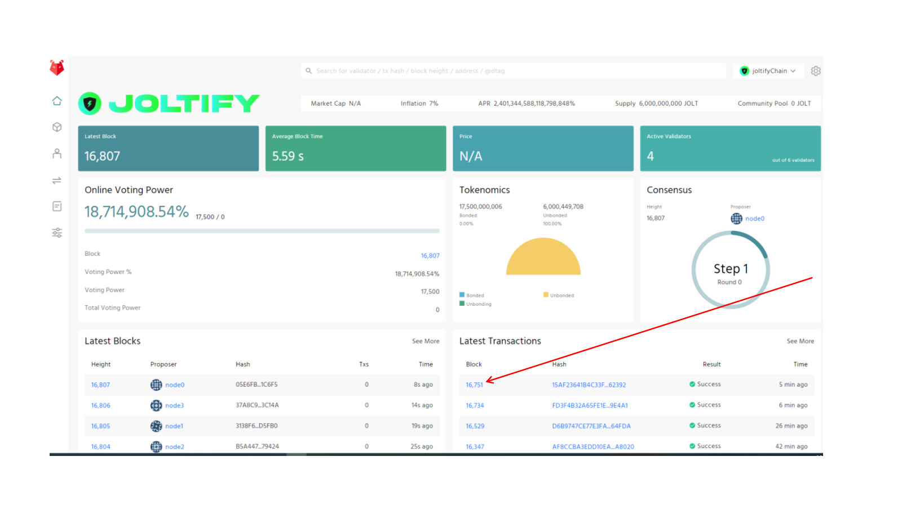
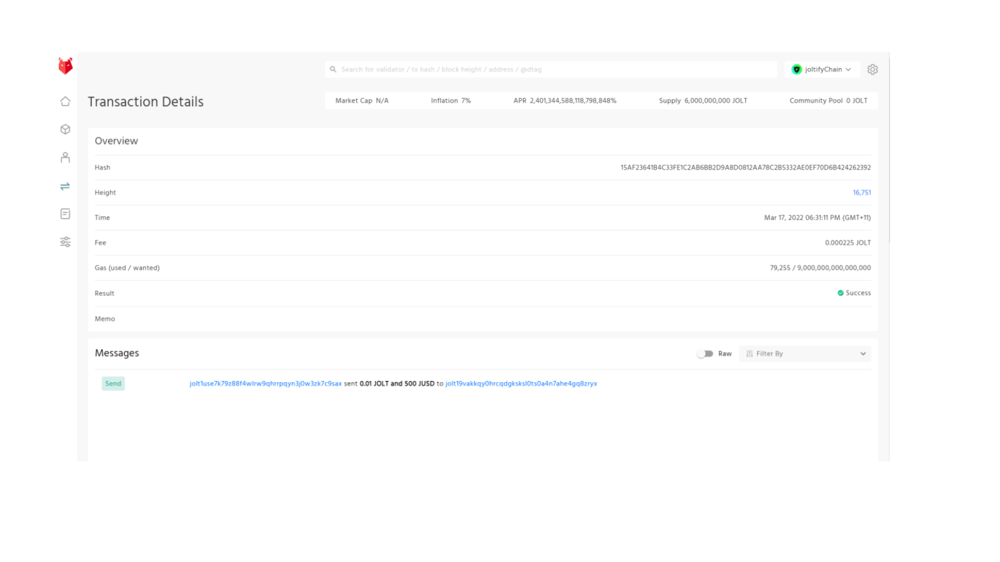

# Check The Transaction Information At Joltify Block Explorer

**We just transferred 500 JUSDs from Joltify to BSC. If you want to know more how we did it, please refer to** [**How to transfer the tokens from Joltify chain to BSC**](how-to-transfer-the-tokens-from-joltify-chain-to-bsc.md)**.  After the transaction, if you want to confirm whether transaction is already on the chain, click this block and see the details of this transaction. You can also check the transaction from** [**BNB Smart Chain Testnet Explorer**](https://testnet.bscscan.com)**. If you want to know more details how to check the transaction from BNB Smart chain Testnet Explorer, please see** [**Check The Transaction Information At BscScan**](check-the-transaction-information-at-bnb-smart-chain-testnet-explorer.md)**.**

**The information of the transaction will be shown like the following.**&#x20;

