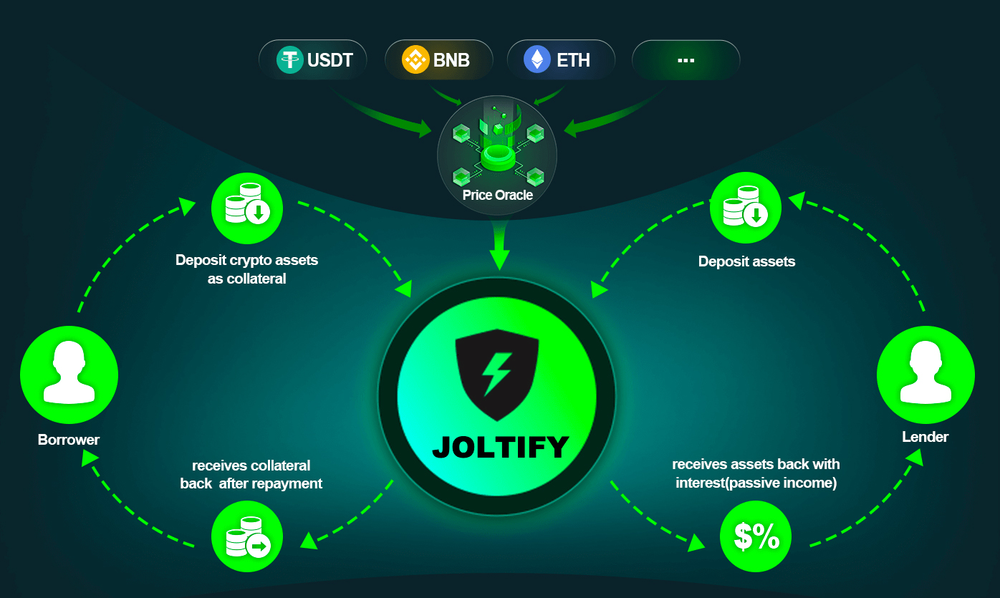

# Backgound

## The Needs for Crypto Assets

Crypto assets, or digital currencies, have become increasingly popular in recent years due to their potential to offer a more decentralized and secure alternative to traditional forms of currency. As with traditional currencies, there is a need for crypto assets to be circulated, exchanged, and used for a variety of purposes. This includes lending, depositing, and purchasing goods and services.

One of the key benefits of crypto assets is their ability to be stored and accessed through a decentralized network, allowing individuals to maintain full control and ownership of their assets. This is in contrast to traditional forms of currency, which are often controlled and regulated by central authorities.

The emergence of decentralized finance (DeFi) has further expanded the potential uses of crypto assets, allowing individuals to earn interest on their assets through blockchain-based protocols. This has opened up new opportunities for earning passive income and participating in the growth of the crypto economy.

Overall, the needs for crypto assets are driven by their potential to offer greater control, security, and accessibility in the world of finance and commerce.

## Mechanism Of Digital Asset Lending

The mechanism of digital asset lending is based on the concept of borrowing and lending. In a digital asset lending arrangement, an individual or entity (the borrower) can borrow a certain amount of a digital asset from another individual or entity (the lender) in exchange for collateral. The borrower agrees to pay back the loan, plus interest, at a specified date in the future.

In Joltify, the loan to value ratio for different tokens varies according to the risks associated with different tokens.

Once the loan agreement has been made, the digital assets are transferred from the lending pool to the borrower's wallet. The borrower can then use the borrowed digital assets for any purpose, such as purchasing goods or services or trading on an exchange.

When the loan is due, the borrower is required to pay back the principal amount of the loan, plus any accrued interest. The digital assets are then transferred back to the lending pool.

Digital asset lending can offer a number of benefits, including the ability to access liquidity without having to sell one's assets, the potential to earn interest on one's digital assets, and the opportunity to diversify one's investment portfolio. However, it is important to carefully evaluate the risks and potential rewards of any digital asset lending arrangement before entering into one.

One of the common problem in the lending is to decide the value of the collateral. Joltify uses price oracle mechanism to get the token prices from Binance, Coinbase or the similar reliable sources.

<figure><figcaption></figcaption></figure>
