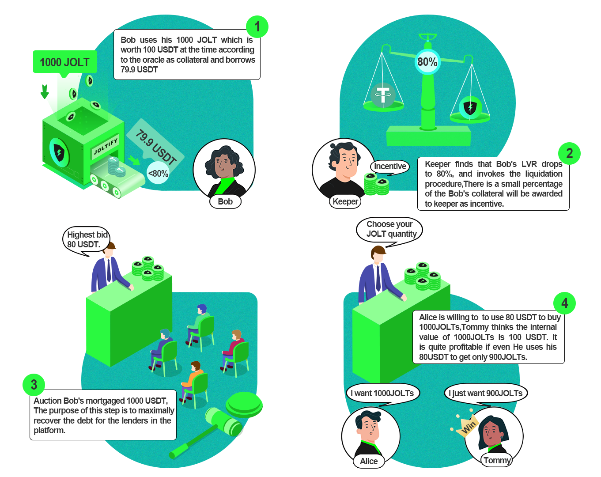

# Liquidation

## How Liquidation works

<figure><figcaption></figcaption></figure>

## One User Case

In this scenario, Bob has borrowed close to the maximum amount allowed by the platform and has accumulated a debt that exceeds the value of his collateral. As a result, his loan is at risk of being liquidated. In a liquidation auction, the platform attempts to recover the debt that Bob owes to the lenders by selling off his collateral.

The details of the scenario are as follows: Bob has 1000 JOLT tokens, which are worth 100 USDT according to the oracle (a system that provides real-time pricing information for assets on the platform). Bob decides to use his JOLTs as collateral and borrows 79.9 USDT, which is close to the maximum LVR (loan-to-value ratio) of 80% that is allowed on the platform. However, Bob has to pay interest on the 79.9 USDT he borrowed, and over time, the interest accumulates. As a result, Bob now has a debt of more than 80 USDT, which includes the 79.9 USDT he borrowed and the interest he has accumulated.

Bob has two choices at this point. He can pay back some of his debt to reduce his LVR to below 80%, or he can put up more collateral to reduce his LVR back to 80%. If Bob chooses not to do either of these things and his LVR remains above 80%, anyone who is aware of this situation can initiate the liquidation process. The person who initiates the liquidation process is known as the keeper, and they may be eligible to receive a small percentage of Bob's collateral as an incentive for their efforts.

During the liquidation process, the platform attempts to recover as much of the debt as possible by selling off Bob's collateral. This can be beneficial for the lenders because it allows them to recover the money that is owed to them. It can also be beneficial for the platform because it helps maintain the value of the collateral and ensures that the platform's rules are being followed. However, it can be detrimental for the borrower like Bob because it results in the loss of their collateral and may damage their creditworthiness.

There are two steps for the liquidation auction.

## Two Steps For Liquidation Auction

### Forward Auction

The forward auction is aimed at recovering the debt that the borrower owes. In the example given, Bob's collateral is JOLTs and his debt is in USDT, so the forward auction is aimed at recovering the USDT that Bob borrowed. In this step, the maximum amount that anyone can bid for the auction is 80 USDT.

Then It goes to the second step.

### Reverse Auction

The reverse auction is aimed at recovering as much of the borrower's collateral as possible. At this stage, the amount of USDT that must be recovered is set at 80 USDT, and users can bid on how much of the borrower's collateral they are willing to buy with that amount of USDT. In the example given, Alice is willing to use 80 USDT to buy 1000 JOLTs, while Tommy thinks that 1000 JOLTs are worth 100 USDT and is willing to use 80 USDT to buy 900 JOLTs. Since Tommy is willing to pay less for the same amount of JOLTs as Alice, he will win the auction and recover 900 JOLTs for his 80 USDT.

The liquidation process can be beneficial for the lenders because it allows them to recover the debt that is owed to them. It can also be beneficial for the platform because it helps maintain the value of the collateral and ensures that the platform's rules are being followed. However, it can be detrimental for the borrower because it results in the loss of their collateral and may damage their creditworthiness.

&#x20;
