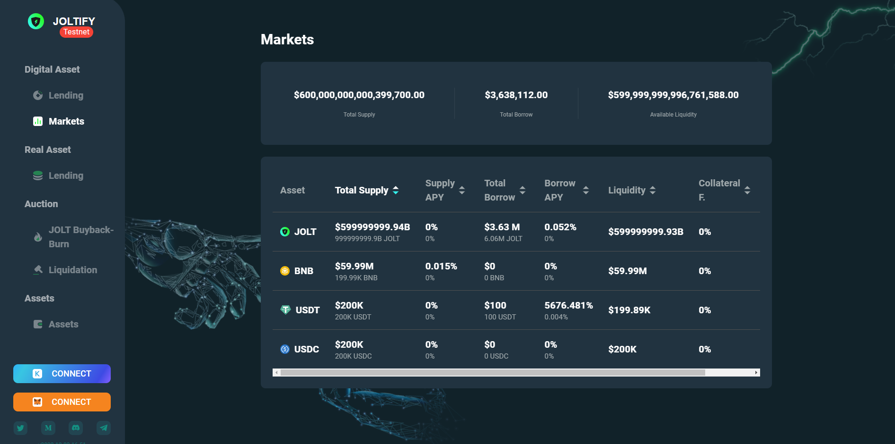
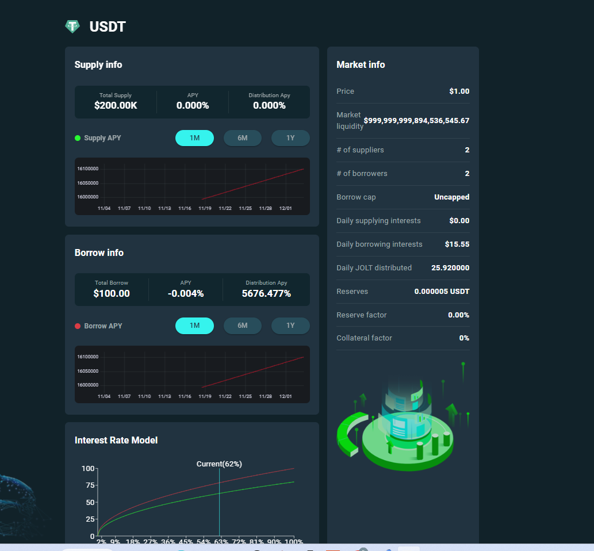

# Market

<figure><figcaption></figcaption></figure>

<figure><figcaption></figcaption></figure>

## Market Terminologies

**Market Liquidity** : Market liquidity refers to the amount of assets available for trading in a particular market. This is an important factor for traders because it determines how easily they can buy or sell an asset. If there is a large amount of liquidity in the market, traders can easily buy or sell an asset without significantly affecting its price. If there is low liquidity in the market, traders may have a harder time buying or selling an asset, and it may be more difficult to get a good price for the asset.

**Borrow cap:** Borrow cap refers to the maximum amount of money that an individual can borrow from a particular pool. This is an important factor for borrowers because it determines how much they can borrow and how much they will need to repay. Borrow caps can vary depending on a number of factors, such as the size of the pool, the type of assets being borrowed.

**Daily supply interests:** Daily supply interests refer to the amount of interest that lenders in a particular pool can expect to earn on their assets in a given day. This is an important factor for lenders because it determines how much they can earn on their assets and how quickly their investment will grow. Daily supply interests can vary depending on a number of factors, such as the type of assets being lent, the size of the pool, and the current market interest rates.

**Daily borrowing interest:** Daily borrowing interest refers to the amount of interest that borrowers in a particular pool will need to pay on their loans in a given day. This is an important factor for borrowers because it determines how much they will need to pay back in addition to the amount they borrowed. Daily borrowing interest can vary depending on a number of factors, such as the size of the loan, the type of assets being borrowed, and the current market interest rates.

**Daily Jolt distributed:** Daily Jolt distributed refers to the amount of Jolts that are paid out from the Joltify platform to users in a particular pool as an incentive in a given day. This is an important factor for users because it determines how much they will earn in rewards for participating in the platform. The amount of daily Jolt distributed can vary depending on a number of factors, such as the size of the pool, the amount of activity on the platform, and the performance of the platform.

**Reserve factor:** Reserve factor refers to the portion of the protocol's revenues from the interests paid by borrowers that will be used to buy back Jolts and burn them to benefit the community of Jolt holders. This is an important factor for Jolt holders because it determines how much of the platform's revenues will be used to support the value of the Jolts they hold. The reserve factor can vary depending on a number of factors, such as the performance of the platform, the market demand for Jolts, and the overall health of the Joltify ecosystem.

**Collateral factor:** Collateral factor refers to the amount that a user can borrow against the collateral they have supplied to the Joltify platform. This is an important factor for borrowers because it determines how much they can borrow based on the assets they have put up as collateral. The collateral factor can vary depending on a number of factors, such as the type and value of the collateral, and the overall health of the Joltify ecosystem.
