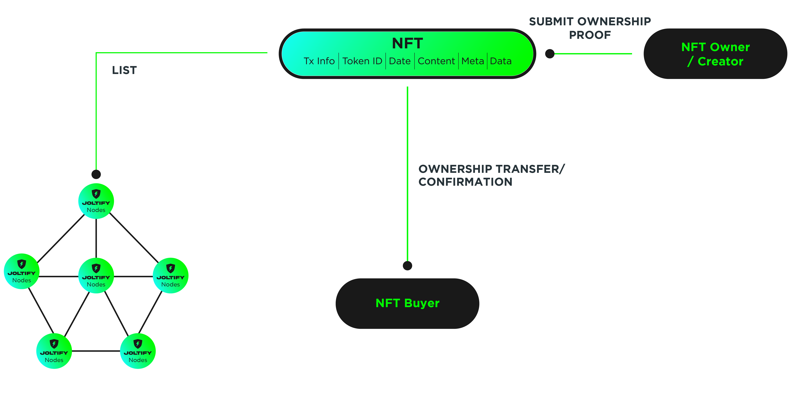

# Tokenize Document To NFTs

### NFTs allow us to bridge and tokenize real world assets into our blockchain, JOLTIFY

NFT stands for "non-fungible token". They are becoming increasingly popular and as time and technology progress, we expect more and more people to utilize NFTs. Currently, the primary understanding on an NFT is linked to Digital Art and Digital Fashion. This is due to the success of art NFT projects such as CryptoPunks, Bored Ape Yacht Club and Art Blocks Curated. However, we must note that with Joltify, the primary use-case for NFTs is profoundly different.

Our NFTs will be primarily utilized in relation to licenses and certifications, essentially used to outline ownership in the crypto world and merging use cases between DeFi and real world projects.

The following diagram outlines how a document can be tokenized into an NFT.

NFT is originally created by the SPV who wants to raise the funds at JOLTIFY. At this stage, the SPV is the NFT creator and the NFT owner. SPV needs to submit the legal preparation of the ownership proof/binding of the real world asset and the NFT. The NFT is then approved and listed on our decentralized JOLTIFY platform. During the project's lifecycle, the ownership of the NFT can then change hands multiple times from the previous investor who wants to out and then to the new investor who wants in. Or, it may be sent to the SPV who then becomes reacquainted with the NFT to facilitate this buyer transfer process or to buy it back at the completion date of the project.
