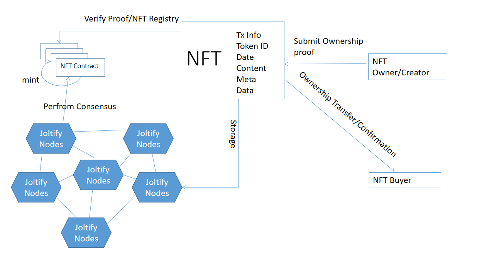

# Tokenize Document To NFTs

### NFTs Allow Us to Bridge and Tokenize Real-World Assets into Our Blockchain, Joltify

NFT stands for "non-fungible token". They are becoming increasingly popular and as time and technology progress, we expect more and more people to utilise NFT's. Currently, the primary understanding on an NFT is linked to Digital Art and Digital Fashion. This is due to the success of art NFT projects such as CryptoPunks, Bored Ape Yacht Club and Art Blocks Curated. However, we must note that with Joltify, the primary use-case for NFTs is profoundly different.

Our NFTs will be primarily utilised in relation to licenses and certifications, essentially used to outline ownership in the crypto world and merging use cases between DeFi and real-world projects.

The following diagram outlines how a document can be tokenized into an NFT.

