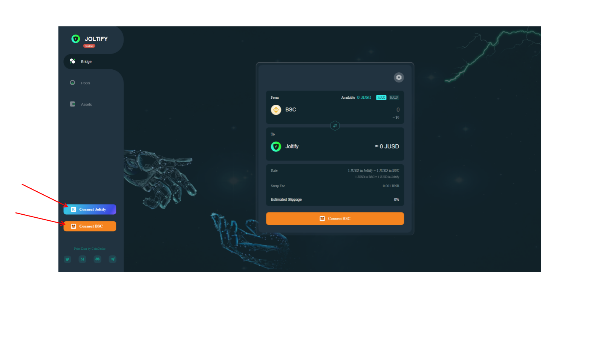

# How to transfer JUSDs from BSC to Joltify Chain?

**First, “Connect BSC” and “Connect Joltify”.**

**Then input the figures  you want to swap, make sure BSC is above, and Joltify is below. Press the ” Swap”  Button.**

**After the swap, you will see the Metamask page shows up. Click “confirm” to confirm the amount you are transferring is correct.**

.png>)

**Click “Confirm” again for the gas fees.**

.png>)

**Now the Swap is done, and the transaction is successful.**

.png>)

**If you want to check the transaction information at the** [**BNB Smart Chain Testnet Explorer**](https://testnet.bscscan.com/) **or at the** [**Joltify Block explorer**](https://test.blockscan.joltify.io/)**, please see** [**Check The Transaction Information At BNB Smart Chain Testnet Explorer**](check-the-transaction-information-at-bnb-smart-chain-testnet-explorer.md) **and** [**Check The Transaction Information At Joltify Block Explorer**](check-the-transaction-information-at-joltify-block-explorer.md) **for more details.**
