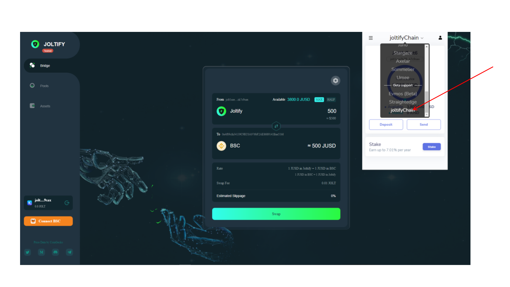
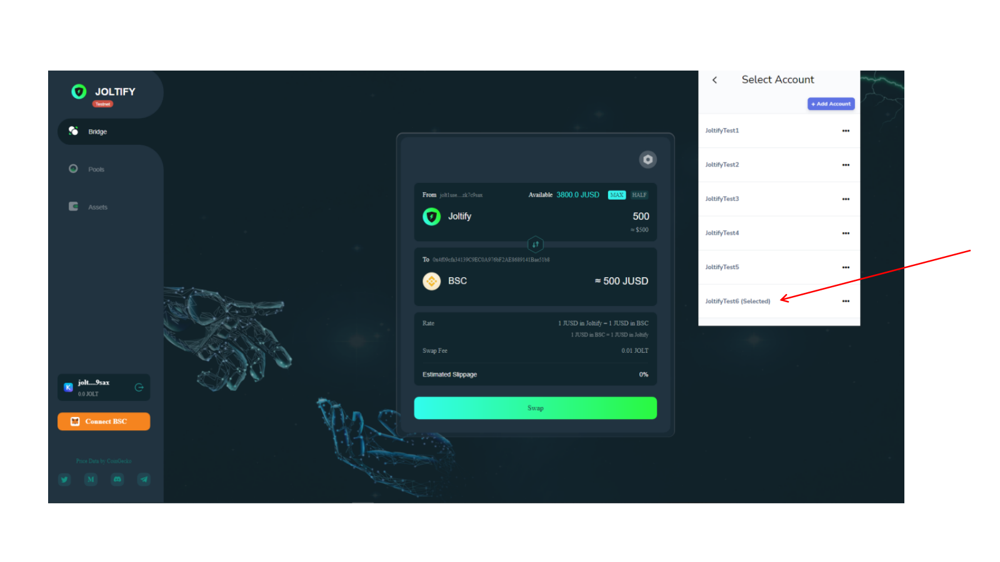
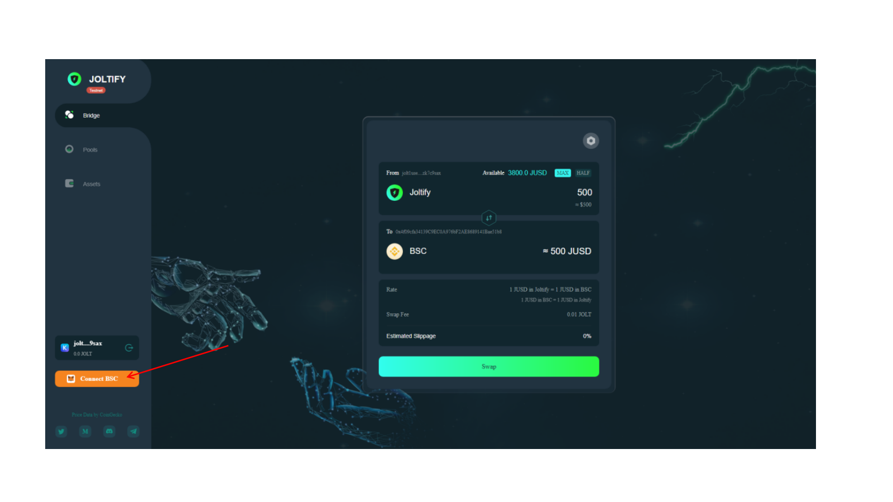
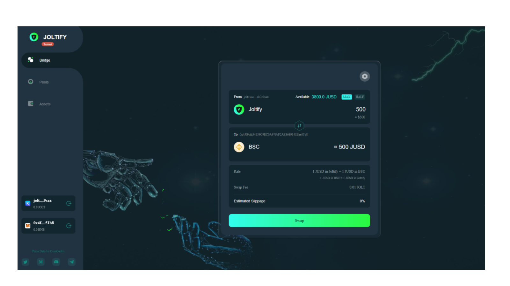
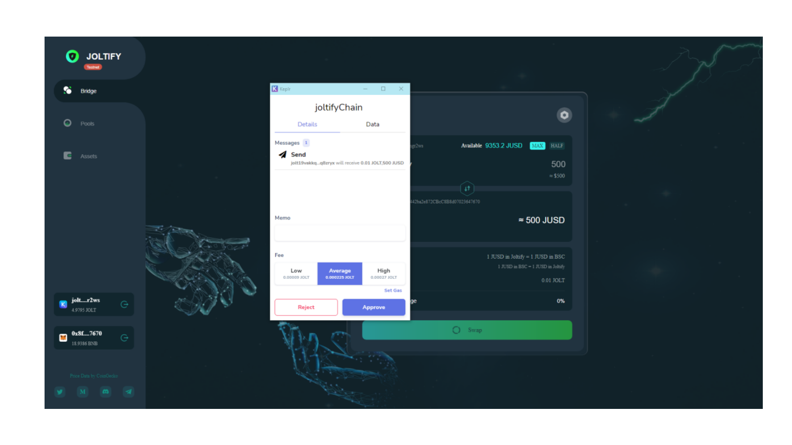
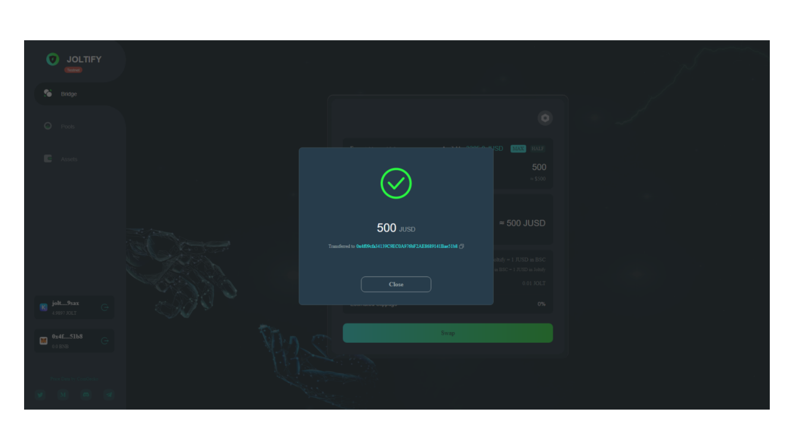

# How To Transfer The Tokens From Joltify Chain to BSC?

## **Transfer from Joltify to BSC**

**First, connect your keplr wallet and choose the Joltify chain in Keplr wallet.**

**If you have not added the Joltify chain to Keplr, please go to this page** [how-to-add-joltify-chain-to-keplr.md](testnet-tutorial/how-to-add-joltify-chain-to-keplr.md "mention") **Add Joltify chain first and come back for the following steps.**

.png>)

**Choose the account you want to transfer from**

__

**Now “Connect BSC”, make sure the account you connect to is matching with account in Keplr.** &#x20;

**What does this mean the account in BSC matches the account in Keplr?**

**The two accounts need to have a same private key.**

**You are ready to transfer the JUSD from Joltify to BSC at this stage.**

**After you input the amount you want to swap, click “Swap”, then click the “Approve” Button.**

**The Swap from BSC to Joltify Chain is done.**

**You can check the transaction information in two ways. One is to check the transaction information at** [**Joltify Block Explorer**](https://test.blockscan.joltify.io)**, Another is to check at the**[ **** ](https://testnet.bscscan.com)****[**BscScan Testnet Explorer**](https://testnet.bscscan.com)**.**
