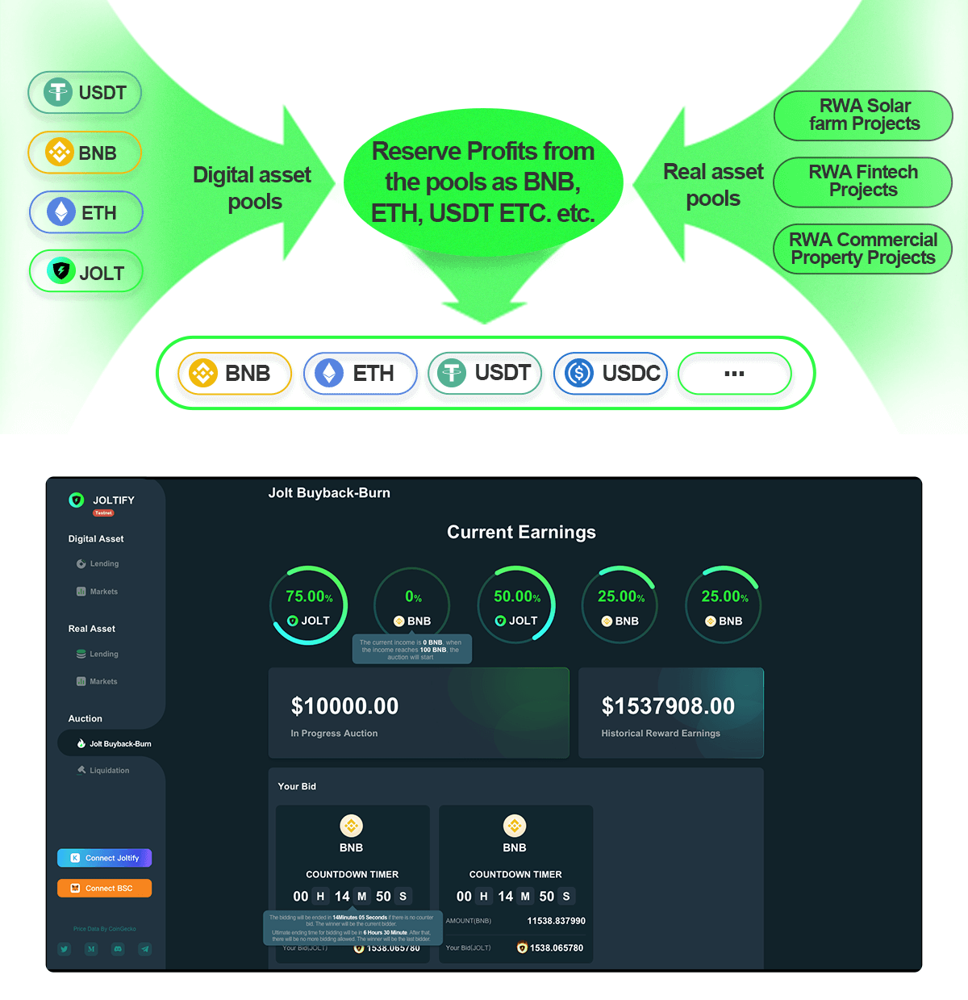
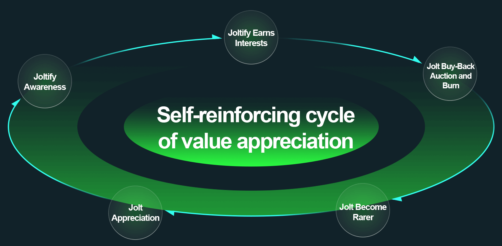

# Jolt Buy-Back And Burn

## Why Jolt Buy-Back And Burn ?

Joltify uses a buy-back and burn model to increase the intrinsic value of its JOLT token. In this model, a portion of the profits generated by the Joltify platform is used to buy back JOLT from the market and permanently destroy them. This reduces the supply of JOLT, which in turn increases its value.

The buy-back and burn model is intended to help Joltify avoid the pitfalls of many blockchain projects, which are often criticized for having no intrinsic value and being little more than Ponzi schemes. By using a buy-back and burn model, Joltify aims to increase the intrinsic value of its JOLT token and create a more stable and sustainable economy for its platform.

Furthermore, by using a decentralized autonomous organization (DAO) to run the platform and sharing profits with the community through JOLT, Joltify aims to create a truly community-driven platform that is transparent and accountable to its users.

<figure><figcaption></figcaption></figure>

## What Will Happen To The Jolt If  Jolt Keeps Burning

<figure><figcaption></figcaption></figure>
