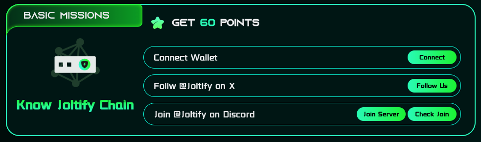

# Basic Missions

The basic missions are designed to enhance participants' familiarity with the Joltify chain. This is achieved by encouraging them to follow Joltify on X (i.e., twitter) and join Joltify's Discord server, fostering a closer connection with the community and the ecosystem.

Within the "Basic Missions," there are three tasks available, allowing participants to collectively earn up to 60 points upon their successful completion.

### **1. Connect Wallet** (**20 points**)

* Read [Get Ready](../joltify-testnet/get-ready.md) to obtain your "Jolt-Address".

### **2. Follow Joltify on X** (**20 points**)

* Each X account can only link to one "Jolt-Address".

### **3. Join Joltify's Discord** (**20 points**)

* Each Discord account can only link to one "Jolt-Address".

<figure><figcaption>
Figure 1. Basic Missions
</figcaption></figure>
