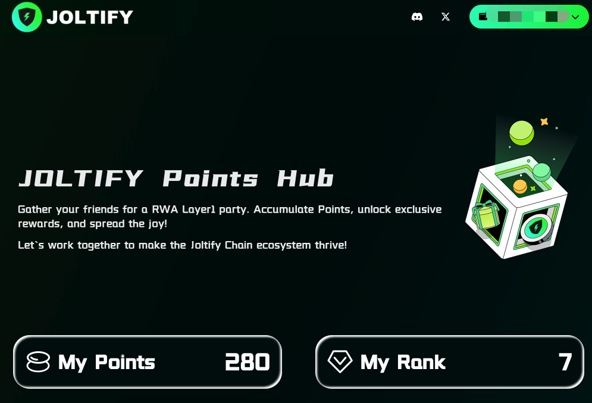

# Introduction

The Joltify point system is designed to encourage participants to integrate with the Joltify ecosystem and promote the Joltify airdrop. The distribution of airdrop rewards will be directly proportional to the points each user has accumulated. After the launch of the Joltify mainnet, participants will be able to claim their airdrop rewards, which will be distributed in the form of JOLT tokens on the Joltify mainnet.

_**\*We reserve the right to modify or adjust the rules pertaining to our airdrop program at our discretion, to accommodate changing circumstances or unforeseen situations.**_

## Invitation Mechanism

Please see more details [here](invitation-mechanism.md).

## Missions

Our points system offers a variety of missions designed to help users and participants accumulate points. These missions are intended to encourage users to engage deeply and explore our platform actively, rewarding their enthusiasm and contributions along the way.

* [Basic Missions](basic-missions.md)
* [Testnet Missions](testnet-missions.md)
* [Mainnet Missions (Coming soon)](mainnet-missions-coming-soon.md)
* [Discord Role Claim](discord-role-claim.md)
* [Partner Missions (Coming soon)](partner-missions-coming-soon.md)

## My Points & My Rank

In the Joltify points system, participants can easily review their accumulated points and the corresponding rank (as shown in Figure 1). Additionally, the points and invitation leaderboards are displayed at the bottom of the page.&#x20;

<figure><figcaption>
Figure 1. My Points &#x26; My Rank
</figcaption></figure>
