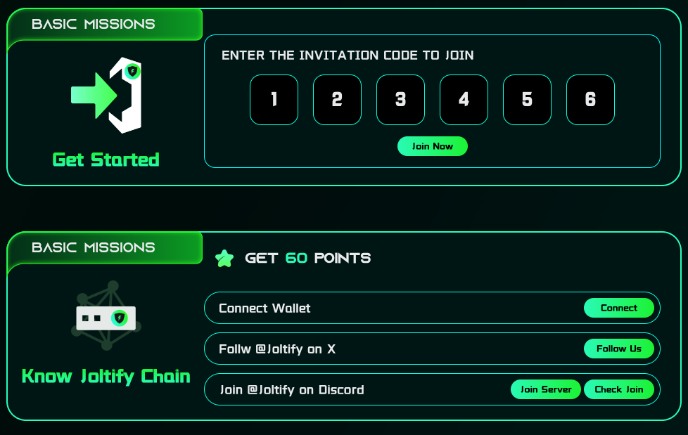
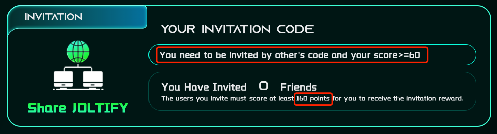

# Invitation Mechanism

The invitation mechanism of our points system is designed to foster community growth and reward active participation. Here's a precise overview:

* (Figure 1) To engage with the points system and begin tasks across various missions (excluding basic missions), participants must first secure a valid invitation code. This code is essential for new users to access and start accruing points through the completion of tasks.
* (Figure 2) Participants can generate their own invitation code after they enter a valid code and reach a milestone of 60 points.
* (Figure 2) Participants are eligible to earn additional points from their invitees once these new members accumulate at least 160 points. More details will be revealed soon.

<figure><figcaption>
Figure 1. Enter the invitaion code
</figcaption></figure>

<figure><figcaption>
Figure 2. Generate your invitation code
</figcaption></figure>
