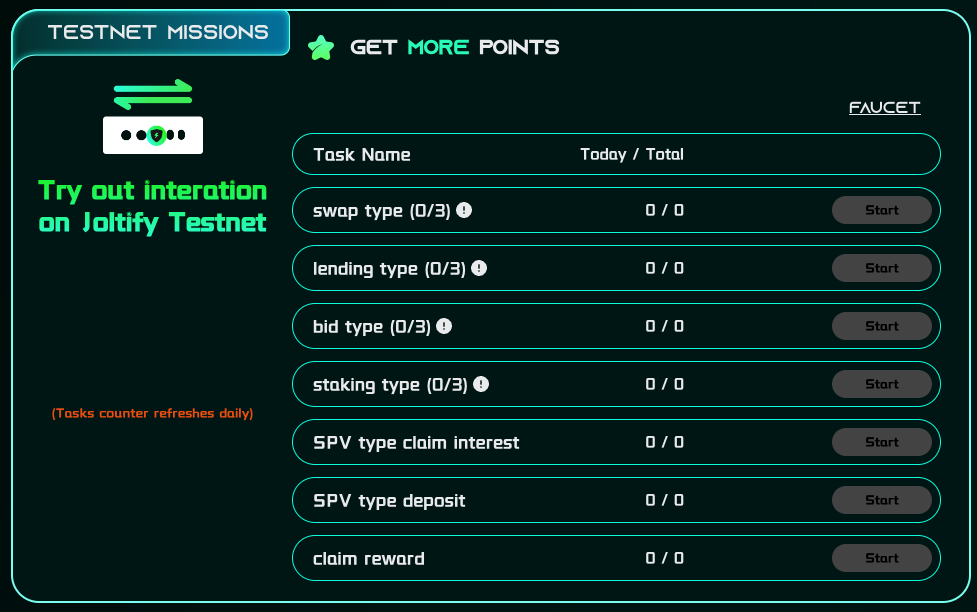

# Testnet Missions

The testnet missions aim to enhance participants' understanding and familiarity of the services offered within the Joltify ecosystem. This is facilitated through interaction with the Joltify testnet across various modules, such as swapping, digital lending, real-world asset (RWA) lending, staking, bidding, and etc.

In the "Testnet Missions," participants are presented with seven tasks, each rewarding 10 points upon completion. Moreover, these tasks can be repeated every 24 hours, offering participants the chance for ongoing engagement and the continuous accumulation of points.

<figure><figcaption>
Figure 1. Testnet Missions
</figcaption></figure>

## **Swap Task** (**10 points**)

* Requirements: Completing **3** swaps.
* Link: [https://testnet2.joltify.io/swap](https://testnet2.joltify.io/swap)
* Guideline: [Swapping](../joltify-testnet/joltify-testnet-guideline.md)

## **Lending Task** (**10 points**)

* Requirements: Complete **3 different** actions in the digital lending module.
* Included Actions: `Deposit`, `Withdraw`, `Borrow`, `Repay`
* &#x20; Link: [https://testnet2.joltify.io/](https://testnet2.joltify.io/)
* Guideline: [Lending](../joltify-testnet/joltify-testnet-guideline.md)

## **Bid Task** (**10 points**)

* Requirements: Complete **3** biddings.
* Link: [https://testnet2.joltify.io/auction-give-back](https://testnet2.joltify.io/auction-give-back), [https://testnet2.joltify.io/auction-liquidate](https://testnet2.joltify.io/auction-liquidate)
* Guideline: [Bidding](../joltify-testnet/jolt-buyback-burn.md)

## **Staking Task** (**10 points**)

* Requirements: Complete **3** actions in the staking module.
* Included Actions: `Claim`, `Delegate`
* Link: [https://testnet2.joltify.io/gov/validators](https://testnet2.joltify.io/gov/validators)

## **SPV Claim Interest** (**10 points**)

* Requirements: Complete the `Claim Interest` action once in RWA projects.
* Link: [https://testnet2.joltify.io/rwa](https://testnet2.joltify.io/rwa)
* Guideline: [RWA Lending](../joltify-testnet/rwa-lending/)

## **SPV Deposit** (**10 points**)

* Requirements: Complete the `Deposit` action once in RWA projects
* Link: [https://testnet2.joltify.io/rwa](https://testnet2.joltify.io/rwa)
* Guideline: [RWA Lending](../joltify-testnet/rwa-lending/)

## **Claim Rewards** (**10 points**)

* Requirement: Complete the `Claim Reward` action once in the digital lending module.
* Link: [https://testnet2.joltify.io/](https://testnet2.joltify.io/)
