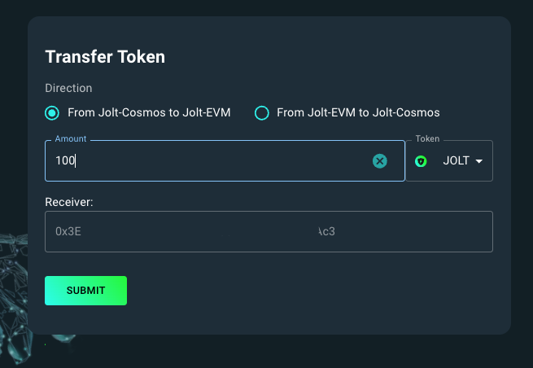

# Token Conversion

## Introduction

To develop on the Joltify EVM co-chain (testnet), developers need to obtain some JOLT tokens and convert them from the Joltify Cosmos chain to the Joltify EVM co-chain.

## 1. Request JOLT Testing Token  <a href="#introduction" id="introduction"></a>

Refer to the [documentation](../../joltify-testnet/get-ready.md) to set up your Keplr wallet and obtain JOLT tokens.

## 2. Token Conversion via Testnet Page

Developers can easily convert JOLT tokens from the Joltify Cosmos chain to the Joltify EVM co-chain using [Joltify Token Conversion Page](https://testnet2.joltify.io/transfer-token).

### Step 1: Navigate to the Token Conversion page&#x20;

### Step 2: Connect your Keplr wallet on the Page

### Step 3: Convert your JOLT tokens

<figure><figcaption><p>Token Conversion (from Joltify cosmos chain to Joltify EVM co-chain)</p></figcaption></figure>

As shown in the figure above, select the JOLT token and enter the amount of JOLT tokens you wish to convert. The receiver address will be automatically generated to receive the converted JOLT tokens on the Joltify EVM co-chain.

## 3. Token Conversion via Command-Line Client

Developers can also convert JOLT tokens via Joltify command-line client as shown below.

```
joltify tx evmutil convert-cosmos-coin-to-erc20 [initiator pubkey]  [receiver_0x_address] [amount] [flags]
```

### Step 1: Install cmd-line client and add your account

First, clone the project and install install the cmd-line client.

```
// clone the project 
git clone https://github.com/joltify-finance/joltify_lending.git

// go to the directory
cd joltify_lending

// install `joltify` cmd-line client
make install
```

Second, add your account with your seed phrase.

```
// run `joltify keys add [name] --recover`
joltify keys add alice --recover

// paste your seed phrase
```

### Step 2: Obtain initiator pubkey

First, obtain your encoded `pubkey` via the following cmd line:

```
joltify keys show --from alice --pubkey
// result: {"@type":"/cosmos.crypto.secp256k1.PubKey","key":"ApFl6rqCSA33Mu3pB8w8+k22kvDcVykJoz8yN7+KlVRx"}
```

Then, convert your encoded pubkey (i.e., `ApFl6rqCSA33Mu3pB8w8+k22kvDcVykJoz8yN7+KlVRx`) into hex string by running the following python script:

```
import base64

# Base64-encoded public key
pubkey_base64 = "ApFl6rqCSA33Mu3pB8w8+k22kvDcVykJoz8yN7+KlVRx"

# Decode from base64 to binary
pubkey_binary = base64.b64decode(pubkey_base64)

# Convert binary to hex
pubkey_hex = pubkey_binary.hex()

print(pubkey_hex)

// result: 029165eaba82480df732ede907cc3cfa4db692f0dc572909a33f3237bf8a955471
```

Now, you have your `initiator pubkey` which is `029165eaba82480df732ede907cc3cfa4db692f0dc572909a33f3237bf8a955471`.&#x20;

### Step 3:  Convert your JOLT&#x20;

```
// joltify tx evmutil convert-cosmos-coin-to-erc20 [initiator pubkey]  [receiver_0x_address] [amount] [flags]

joltify tx evmutil convert-cosmos-coin-to-erc20 \
029165eaba82480df732ede907cc3cfa4db692f0dc572909a33f3237bf8a955471 \ 
0xc65B85A4c0F451bB7d283aD6462cB7A144541839 \
100000000000ujolt --from alice --gas 8000000 
```

