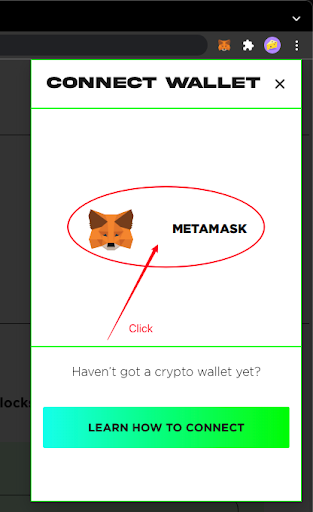
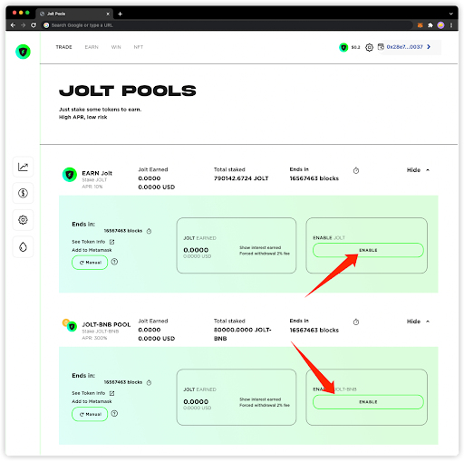
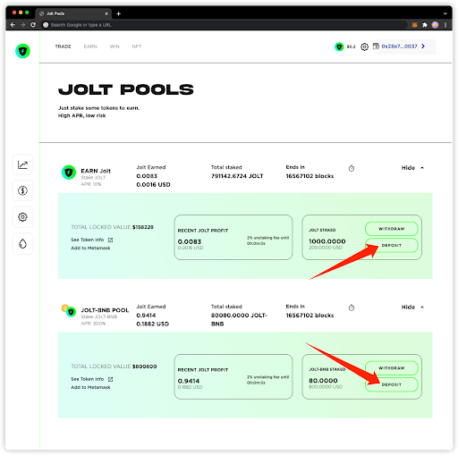
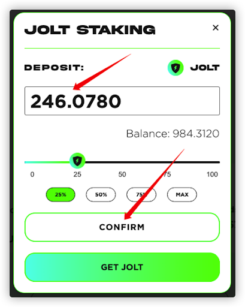

# Staking JOLT/LP Token

There is a few steps that to stake JOLT or LP Token.

### 1. Connect to the Metamask. **PLEASE ENSURE YOU ARE IN BSC NETWORK.**

### 2. Enable the JOLT or LP token Staking contract.

### 3. Stake the token with a given amount.

