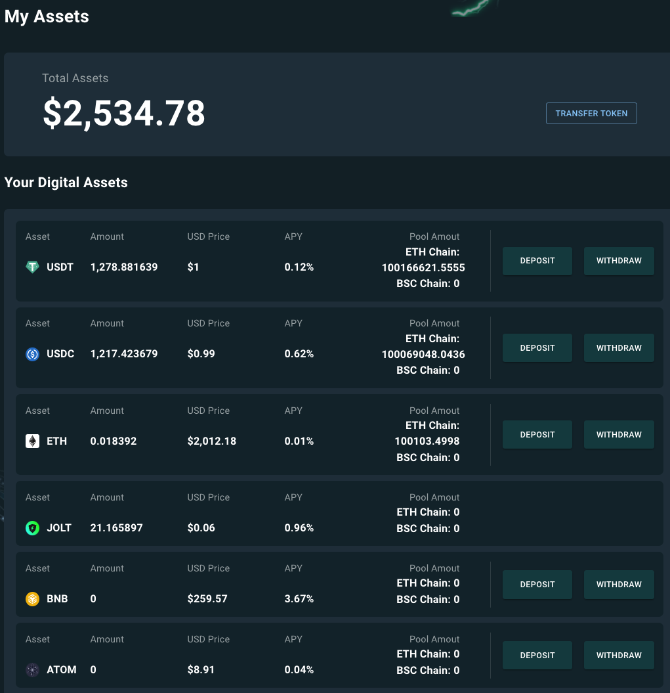
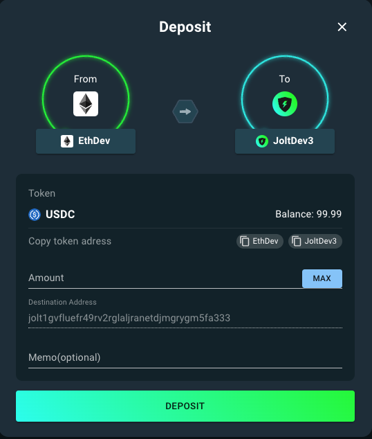
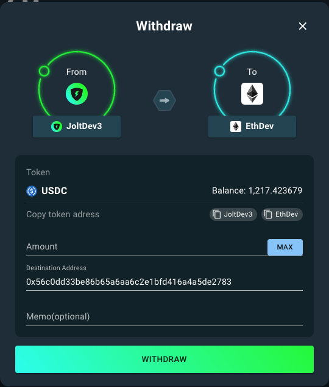

# Cross-Chain Bridge

A bridging function in the context of cryptocurrency and decentralized finance (DeFi) refers to a mechanism that allows for the transfer of assets or data between different blockchain networks. This function is crucial because each blockchain operates independently, with its own protocols and ledger.

The Joltify bridging function is a specialized feature designed for transferring assets between the Joltify chain (cosmos-based chain) and various EVM-compatible blockchains (e.g., Ethereum and BNB Chain).

## Setup

To simplify testing the bridging function on the Joltify testnet, the Joltify team offers a mock ETH chain that can be configured in the MetaMask wallet. For detailed instructions, please refer to [here](get-ready.md#3.-add-the-ethereum-mock-chain-to-the-metamask-wallet).

The guideline includes steps for adding the mock ETH chain to MetaMask and importing test tokens such as USDT and USDC.

Notably, only specific assets—USDT, USDC, and ETH—are supported for transfer between the Joltify testnet chain and the mock ETH chain.


You can also view the [demonstration video](https://www.youtube.com/watch?v=sdApV2L2\_58) for quick guidance on configuring the mock ETH chain in MetaMask and importing test tokens.


## Bridge Test

To test the bridging function on the Joltify testnet, visit the "assets" page using the provided [link](https://testnet2.joltify.io/assets).

On the page, users can **Deposit** assets from EVM-compatible chains to the Joltify chain and **Withdraw** assets from the Joltify chain to other EVM-compatible chains.

<figure><figcaption>
Figure 1. Assets
</figcaption></figure>

Figure 1 displays a list of assets on the page, ranked according to their value as held by users. It's important to understand each parameter presented on this page:

* **Amount**: Indicates the quantity of tokens owned by users on the Joltify chain.
* **USD Price**: Shows the current price of the asset in USD.
* **APY (Annual Percentage Yield)**: Represents the annual rate of return for supplying the asset to Joltify's digital lending module.
* **Pool Amount**: Displays the total amount available for users to withdraw from the Joltify chain to the corresponding EVM-compatible chains.


You can watch the [demonstration video](https://www.youtube.com/watch?v=CaLx8no1\_bo) to perform the above operation.


### Deposit

When you click the "**Deposit**" button, a new window (Figure 2) appears with the following parameters:

* **Balance**: Shows the asset balance on EVM-compatible chains, fetched from the MetaMask wallet when connected to the correct network.
* **Amount**: Specifies the quantity of the asset you wish to transfer from EVM-compatible chains to the Joltify chain.
* **Destination Address**: Displays the receiving address on the Joltify chain, which is auto-filled if the Keplr wallet is connected to the appropriate network.
* **Memo**: An optional field for users to add a message to their "Deposit" transaction.

<figure><figcaption>
Figure 2. Deposit
</figcaption></figure>

### Withdraw

When you click the "**Withdraw**" button, a new window (Figure 2) appears with the following parameters:

* **Balance**: Shows the asset balance on the Joltify chain, retrieved from the Keplr wallet.
* **Amount**: Specifies the amount of the asset you intend to transfer from the Joltify chain to EVM-compatible chains.
* **Destination Address**: Displays the recipient's address on the EVM chains, initially sourced from the MetaMask wallet but can be modified to any EVM address.
* **Memo**: An optional field for users to include a message with their "Deposit" transaction.

<figure><figcaption>
Figure 3. Withdraw
</figcaption></figure>
