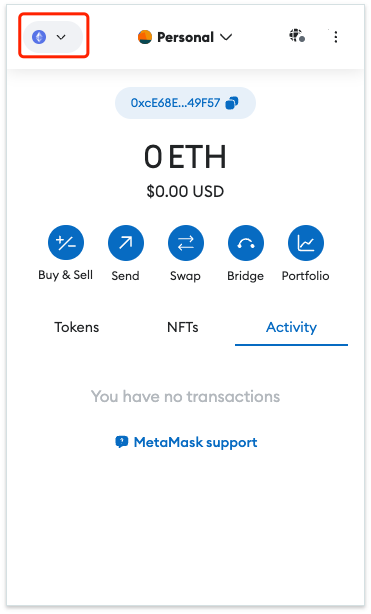

# Get Ready

To participate in the Joltify Testnet Campaign, users are required to obtain their "jolt-address" and request test tokens.

## 1. Obtain your "Jolt-Address" with the Keplr Wallet

Users are required to obtain their **jolt-address** to participate in the testnet campaign.

### Steps to get jolt-address

1. **Download** [the Keplr Wallet extension](https://chrome.google.com/webstore/detail/keplr/dmkamcknogkgcdfhhbddcghachkejeap) from the Chrome Web Store.
2. **Create** new wallets or **Add** existing wallets to the Keplr Wallet.
3. **Visit** the Joltify Testnet and **Approve** the connection in the Keplr Wallet.
4. **Enable** the visibility of the Joltify Testnet network in the Keplr Wallet.
   1. Go to "Settings" -> "General" -> "Manage Chain Visibility".
   2. Search "Joltify Testnet network" by typing `JoltDev3`.
      1. The Joltify Testnet ChainID is `JoltDev3`.
   3. Tick the box to enable the visibility of the Joltify Testnet network on Keplr.
5. **Copy** your _**jolt-address**_.
   1. Open the Keplr Wallet extension.
   2. Click "copy address".
   3. Search for "jolt" (bookmark the Joltify Testnet network).
   4. copy your _jolt-address_.


Users can also watch the [demonstration video](https://www.youtube.com/watch?v=dQI3AXvuZjs\&ab\_channel=SaltyCrypto) for step-by-step guidance.


## 2. Request Test Tokens

1. Join our [Discord Community](https://discord.com/invite/HSn3C3RUmb).
2. Send your _**jolt-address**_ in the **#faucet** channel to claim your test tokens.


Note that, each discord account can only request test tokens once.


## 3. Add the Ethereum Mock Chain to the MetaMask Wallet

To facilitate the testing of the bridging function offered by the Joltify testnet, we have introduced an Ethereum mock chain. Users wishing to test this bridging functionality need to connect the Ethereum mock chain with their MetaMask wallet by following the steps outlined below.

1. **Install the MetaMask Wallet Extension**: Begin by downloading the MetaMask Wallet extension from the Chrome Web Store.
2. **Set Up Your Wallet**: Once installed, you can either create a new wallet or import existing wallets into MetaMask.
3. **Add the Ethereum Mock Chain**: Finally, add an Ethereum mock chain to your MetaMask wallet for testing and development purposes.
   1. **Click** the network button located at the top-left corner of the interface and **Select** the "Add network" button to initiate the process of adding a customised network.\
      .png>)
   2. **Click** "Add a network maunually" and **Complete** the setup by filling in the necessary configuration details for the new chain.\
      .png>).png>)
      1. (customisable) **Network name**: ETH Mock Chain
      2. **New RPC URL**: [http://65.109.48.184:8545](http://65.109.48.184:8545)
      3. **Chain ID**: 1337
      4. (customisable) **Currency symbol**: ETH
4.  **Import ERC20 Tokens**: Complete your setup by importing the mock ERC20 tokens into your MetaMask wallet.

    1. To add test tokens such as USDT or USDC, simply click on "Import Tokens".
    2. Once you provide the token address, the details such as the token symbol and decimals will be automatically filled.
       1. JOLT-USDT: 0xCB4471f0FBE3d66ad0b9A629606C6509A80612d6
       2. JOLT-USDC: 0x7CC0DD0ec9AC0F68576281Dd2bA69a7b6c2B243e

    .png>)    .png>)

Upon completing the setup, you will be able to view your token balance displayed in your MetaMask wallet as shown below:

<figure><figcaption></figcaption></figure>
