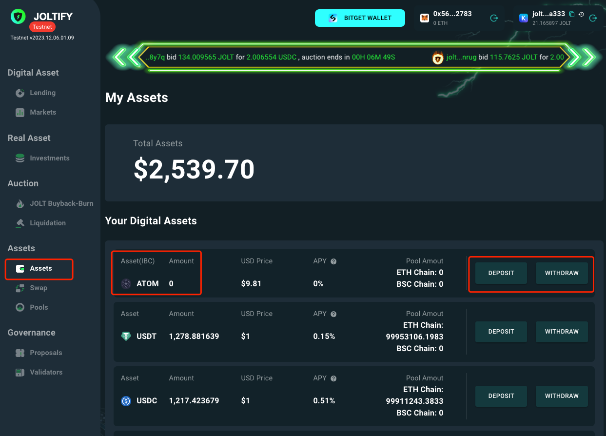
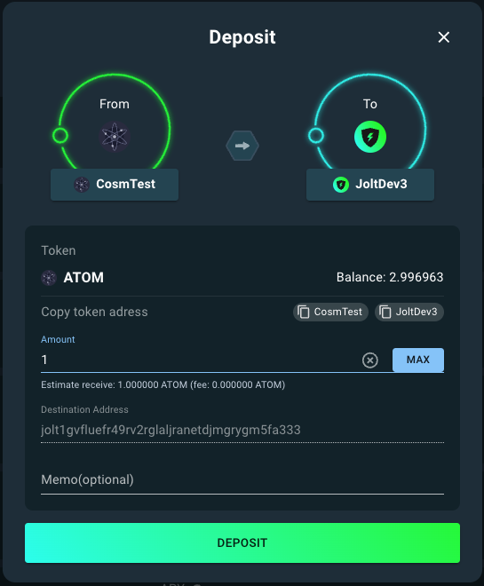
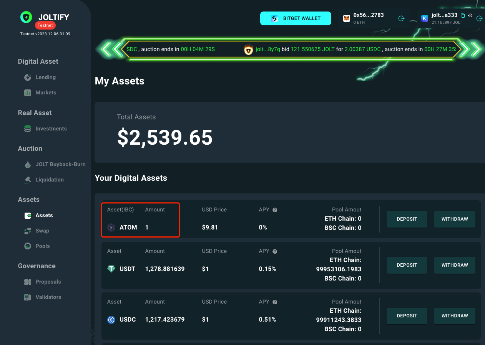
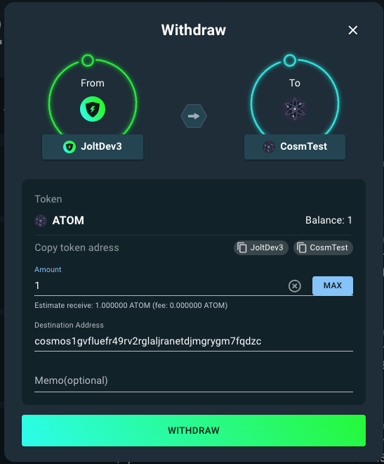
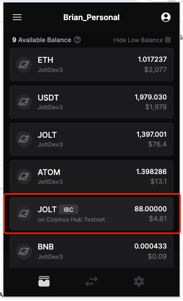
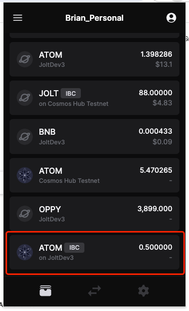

# Joltify IBC Transfers

The Joltify chain empowers the IBC protocol, potentially connecting 30+ IBC chains and allowing users to effortlessly exchange information and assets between the Joltify chain and other chains.

In this tutorial, we'll walk you through the simple steps to conduct IBC transfers between the Joltify testnet and the Cosmos testnet.

***

## Setup

Before making Joltify IBC transfers, there are a few setup steps to ensure your Keplr wallet is ready for Joltify IBC transfers:


You can watch the [demonstration video](https://www.youtube.com/watch?v=3U9OgusN4W0) for quick guidance.


### 1. Add the Cosmos Testnet to the Keplr Wallet

* Visit [https://chains.keplr.app](https://chains.keplr.app/).
* Search `Cosmos Hub Testnet` to add the Cosmos testnet to your Keplr wallet.
* Click the `Manage Chain Visibility` button in your Keplr wallet to make the Cosmos testnet visible.

### 2. Get testing ATOM coins

* Join the Cosmos Network's discord server through this link [here](https://discord.gg/invite/cosmosnetwork).
* Navigate to the `testnet-faucet` channel in the Discord server.
* Copy your cosmos-address from your Keplr wallet.
* Send the request: `$request theta-testnet-001 [cosmos-address]`.

### 3. Enable the IBC transfer feature

* Open your Keplr wallet.
* Go to the `Advanced` settings menu.
* Turn on the `Developer Mode`.

Once you've completed all these settings, you'll be ready to conduct Joltify IBC transfers.

***

## Joltify IBC Transfers on the Joltify testnet

Users can conduct IBC transfers on the [asset page](https://testnet2.joltify.io/assets) of the Joltify testnet for assets


You can watch the [demonstration video](https://www.youtube.com/watch?v=G6RcwaB4vTk) for quick guidance.


### Select assets labelled as "IBC"

Users can conduct IBC transfers on the Joltify testnet for assets labelled as "IBC".

<figure><figcaption></figcaption></figure>

In this case, we will demonstrate Joltify IBC transfers by transferring "ATOM" between the Joltify testnet and the Cosmos testnet.

### Deposit

When you click the "**Deposit**" button, a new window appears with the following parameters:

* **Balance**: Shows the balance of ATOM coins on the Cosmos testnet, fetched from the Keplr wallet.
* **Amount**: Specifies the quantity of ATOM coins you wish to transfer from the Cosmos testnet to the Joltify testnet.
* **Destination Address**: Displays the receiving address on the Joltify chain, which is auto-filled if the Keplr wallet is connected.
* **Memo**: An optional field for users to add a message to their "Deposit" transaction.

<figure><figcaption></figcaption></figure>

Once the IBC transfer transaction is conducted successfully, the amount of asset will increase accordingly on the page.

<figure><figcaption></figcaption></figure>

### Withdraw

When you click the "**Withdraw**" button, a new window appears with the following parameters:

* **Balance**: Shows the balance of ATOM coins on the Joltify testnet, fetched from the Keplr wallet.
* **Amount**: Specifies the quantity of ATOM coins you wish to transfer from the Joltify testnet to the Cosmos testnet.
* **Destination Address**: Displays the receiving address on the Cosmos testnet, which is auto-filled if the Keplr wallet is connected. Moreover, you can also provided the expected destination address for the `Withdraw` action.
* **Memo**: An optional field for users to add a message to their "Withdraw" transaction.

<figure><figcaption></figcaption></figure>

Once the IBC transfer transaction is conducted successfully, the amount of asset will decrease accordingly on the page.

***

## Joltify IBC Transfers using the Keplr wallet

Users can also conduct IBC transfers between the Joltify testnet and the Cosmos testnet.


You can watch the [demonstration video](https://www.youtube.com/watch?v=G6RcwaB4vTk) for quick guidance.


### Transfer \`JOLT\` from the Joltify testnet to the Cosmos testnet

* Open your Keplr wallet.
* Click the `Transfer` button located at the bottom of your Keplr wallet.
* Select the `JOLT` coin on **the Joltify testnet**.
* Choose the destination chain.
  * If it's your first time making an IBC transfer, click `New IBC transfer channel` to add the IBC transfer channel with the following configuration:
    * Destination Chain: `Cosmos Hub Testnet`
    * Channel ID: `channel-2`
* Select the receiver's address on the Cosmos testnet.
* Input the amount of `JOLT` coins you want to transfer to the Cosmos testnet.
* Approve the transaction.\
  \
  \
  

After the successful transaction, you'll notice a decrease in JOLT coins on the Joltify testnet and an increase of JOLT coins labeled as "IBC" on the Cosmos testnet.

<figure><figcaption></figcaption></figure>

### Transfer \`JOLT\` from the Joltify testnet to the Cosmos testnet

* Open your Keplr wallet.
* Click the `Transfer` button located at the bottom of your Keplr wallet.
* Select the `ATOM` coin on **the Cosmos testnet**.
* Choose the destination chain.
  * If it's your first IBC transfer, click `New IBC transfer channel` to add the IBC transfer channel with the following configuration:
    * Destination Chain: `JoltDev3`
    * Channel ID: `channel-3361`
* Select the receiver's address on the Joltify testnet.
* Input the amount of `ATOM` coins you want to transfer to the Joltify testnet.
* Approve the transaction.\
  \
  

After the successful transaction, you'll notice a decrease in ATOM coins on the Cosmos testnet and an increase of ATOM coins labeled as "IBC" on the Joltify testnet.

<figure><figcaption></figcaption></figure>

***

## Supported IBC Channels

### Joltify Testnet <--> Cosmos Testnet

* Channel ID (from the Joltify testnet): `channel-2`
* Channel ID (from the Cosmos testnet): `channel-3361`
