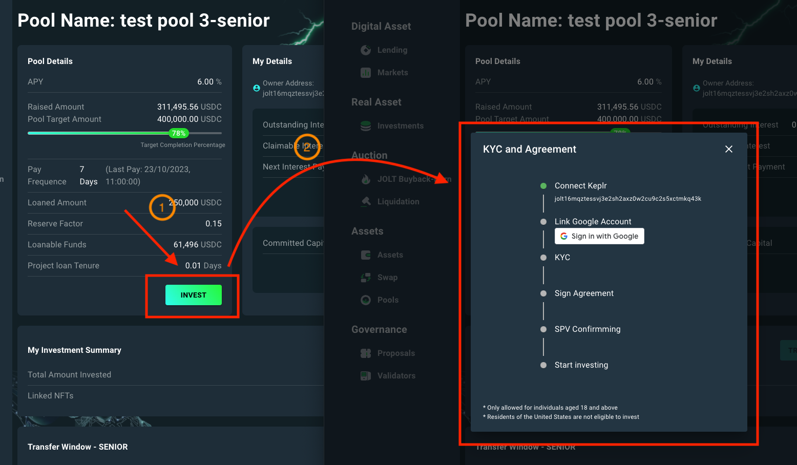
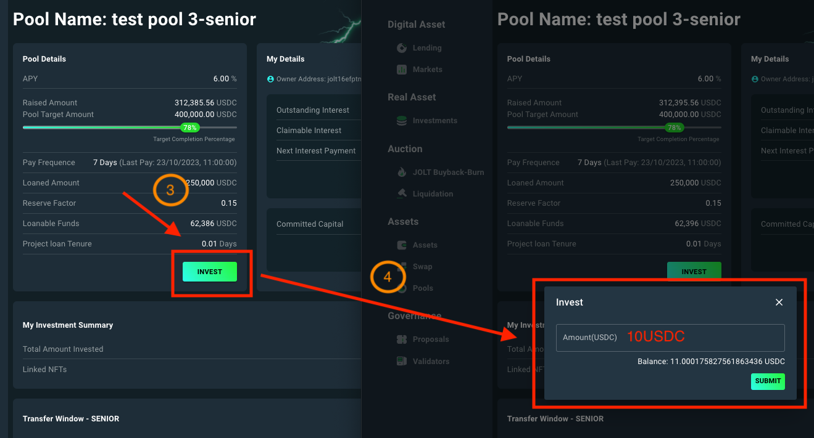
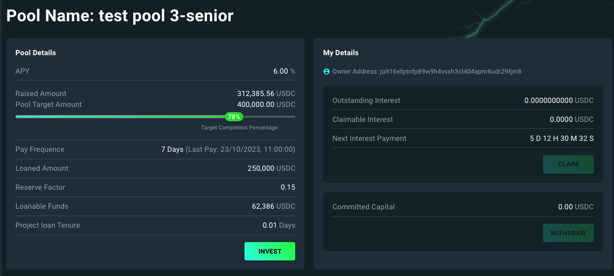
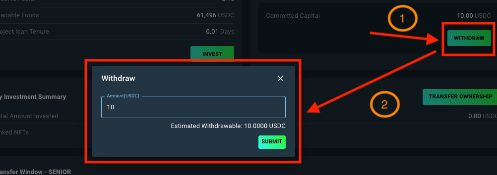
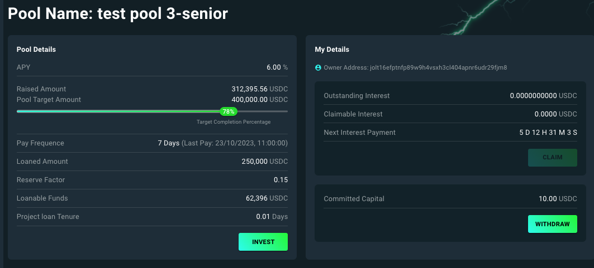
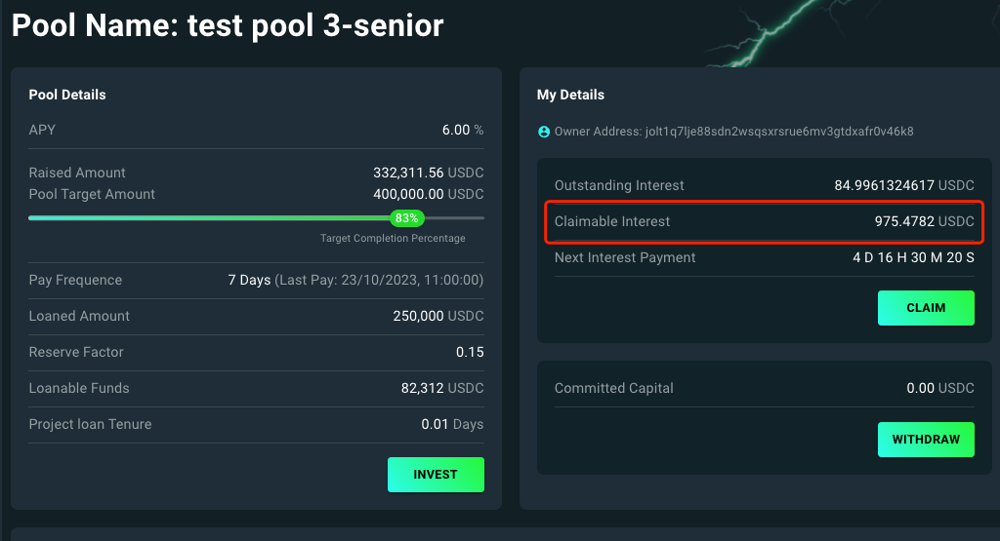
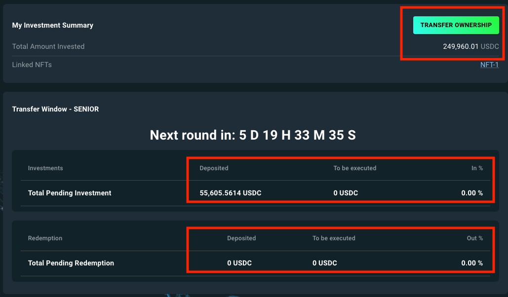
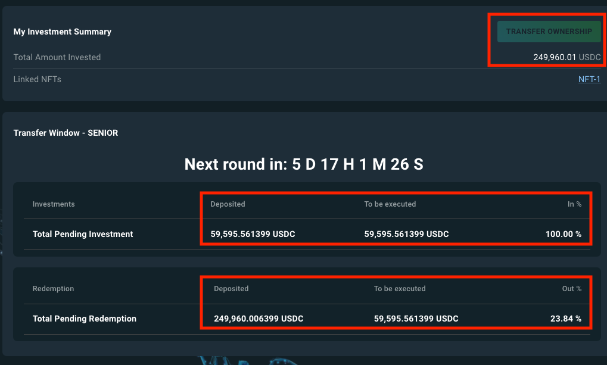

# Investor Guideline

## Pool Section

To begin your investment journey, follow the steps below to select a desired pool created by the SPV:

<figure><figcaption>
Figure 1: Pool selection.
</figcaption></figure>

1. **Accessing the RWA Page:** Click the "Investments" button to directly access the RWA page.
2. **Choosing a Project:** On the RWA page, click your desired project to enter its individual "Project" page.
3. **Pool Selection:** Within the "Project" page, choose one of the available pools to commence your investment.

Once a pool is selected, you'll be directed to a detailed page displaying information and options related to your chosen pool (in Figure 2).

<figure><figcaption>
Figure 2: Personal investing page.
</figcaption></figure>

On the detailed investing page, users are presented with five actions to facilitate their investment activities: `INVEST`, `WITHDRAW`, `CLAIM`, `TRANSFER OWNERSHIP`, and `SUBMIT WITHDRAWAL PROPOSAL`.

***

## The "INVEST" Button

### Before investing

For first-time investors in the pool, clicking the `INVEST` button will guide you through the following essential tasks:

1. Link your Google Account.
2. Pass the KYC.
3. Sign Investment Agreement.

Once the above tasks are done, the user needs to wait for the SPV to grant you permission to invest.

<figure><figcaption>
Figure 3: KYC verification &#x26; Agreement signing.
</figcaption></figure>


In the Joltify Testnet, as long as users sign in with Google, they can begin their investments.


### Investing

After receiving the investment permission from the SPV, the user can click the `INVEST` button again and input the desired amount to invest.

<figure><figcaption>
Figure 4: Investing.
</figcaption></figure>

As a result, the **Raise Amount** and **Loanable Funds** in the [Pool Details](investor-guideline.md#pool-details) section, along with the **Committed Capital** in the [My Details](investor-guideline.md#my-details) section, increase based on the deposited amount.

<figure><figcaption>
Figure 5: Before investing.
</figcaption></figure>

<figure><figcaption>
Figure 6: After investing.
</figcaption></figure>

***

## The "WITHDRAW" Button

The user can withdraw the committed assets by clicking the `WITHDRAW` button and inputing the desired amount.

<figure><figcaption>
Figure 7: Withdrawing the committed assets.
</figcaption></figure>

As a result, the **Committed Capital** in the [My Details](investor-guideline.md#my-details) section decreases based on the withdrawal amount.

<figure><figcaption>
Figure 8: Before withdrawing
</figcaption></figure>

<figure><figcaption>
Figure 9: After withdrawing.
</figcaption></figure>

Moreover, the withdraw function works for three types of assets:

1. Newly committed assets.
2. Asset transferred out from the pool through the `TRANSFER OWNERSHIP` function.
3. Asset repaid by the SPV.

***

## The "CLAIM" Button

To claim the interest accumulated from the previous payment rounds, the user simply clicks on the `CLAIM` button to receive the claimable interests.

As shown in Figure 10, `975.4782` USDC can be claimed by the user.

<figure><figcaption>
Figure 10: Interests claiming.
</figcaption></figure>


Please note that the accumulated interests can only be claimed when the SPV makes the interest payments.


***

## The "TRANSFER OWNERSHIP" Button

The function `TRANSFER OWNERSHIP` is a unique functionality provided by the Joltify to help users withdraw their invested assets from the pool before the pool due time.

The below two figures (Figure 11 and 12) present the effect of the ownership transfer for the user's invested assets.

<figure><figcaption>
Figure 11: Before transferring the ownership of the invested assets.
</figcaption></figure>

As shown in Figure 11, the user has `249,960 USDC` invested into the pool. Moreover, the [Transfer Window](notation-explanation.md#transfer-window) section shows that there is `55,605 USDC` committed to be included in the pool to gain interests and there is no invested assets requesting the ownership transfer.

Once the user clicks the `TRANSFER OWNERSHIP` button, `249,960 USDC` will be taken into the ownership transfer process. The `TRANSFER OWNERSHIP` button will then be disabled.

<figure><figcaption>
Figure 12: After transferring the ownership of the invested assets.
</figcaption></figure>

Once the ownership transfer request is processed, the parameters within the [Transfer Window](notation-explanation.md#transfer-window) are updated accordingly.

In this scenario, given that the committed assets are fewer than the invested assets awaiting ownership transfer, the entirety (100%) of the committed assets will be classified in the pool as 'invested assets'. However, only 23.84% of the user's invested assets will transition from the pool and become eligible for withdrawal.

If no new ownership transfer requests are made and no fresh assets are committed, the `59,595 USDC` previously committed by other participants will be incorporated into the pool after `5D 17H 1M 26S`. Simultaneously, the `59,595 USDC`, invested by the current user, becomes eligible for withdrawal. The residual amount, calculated as `(249,960 - 59,595) USDC`, will continue to be invested in the pool.


Once the user requests an ownership transfer, his/her committed assets will not be considered in the ownership transfer process.


***

## The "SUBMIT WITHDRAWAL PROPOSAL" Button

The `SUBMIT WITHDRAWAL PROPOSAL` button is accessible only during specific time windows.

By sending the `SUBMIT WITHDRAWAL PROPOSAL` transaction, the SPV will then return users' invested assets before reaching the loan's tenure.
