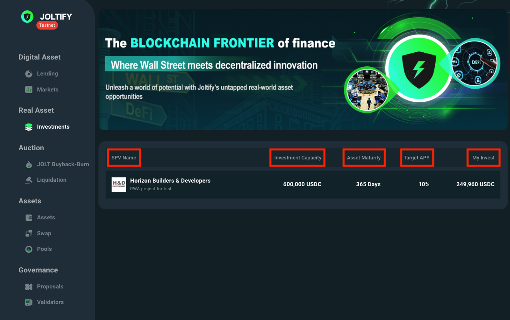
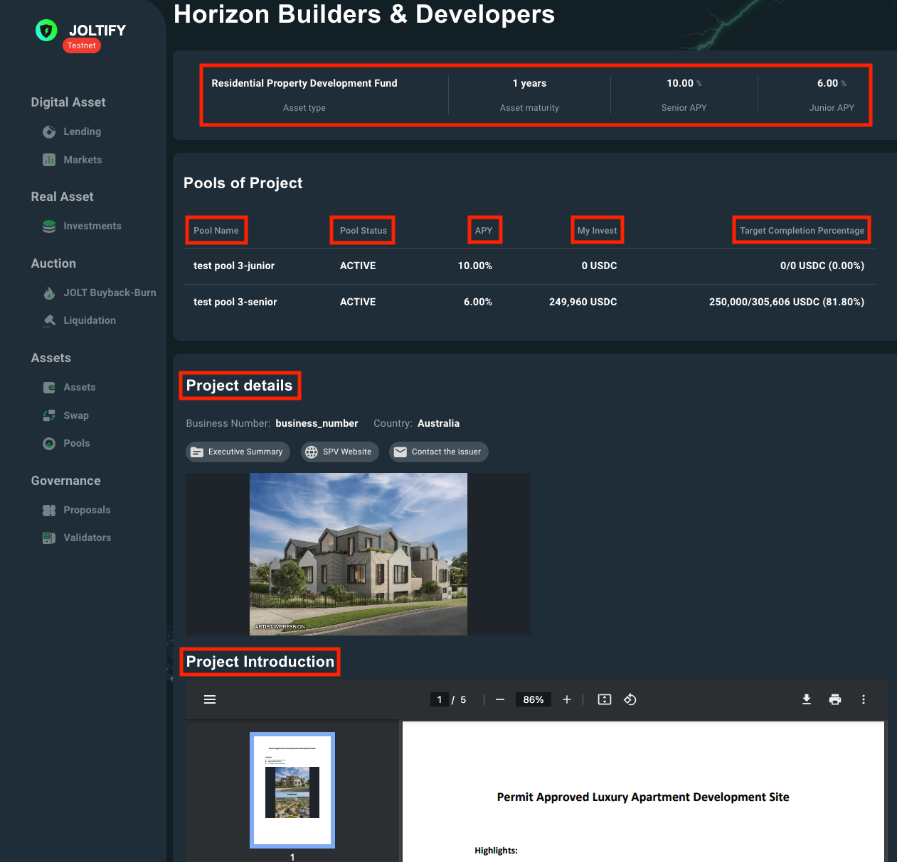

# Notation Explanation

There are three pivotal pages for RWA investing:

1. [**The "RWA" Page**](notation-explanation.md#the-rwa-page)
2. [**The "Project" Page**](notation-explanation.md#the-project-page)
3. [**The "Personal Investment" Page**](notation-explanation.md#the-personal-investment-page)

For a better understanding of the RWA project investing process, we've provided explanations for the notations used on each page.

## The "RWA" Page

<figure><figcaption>
Figure 1: The RWA page lists all available RWA projects for investing.
</figcaption></figure>

The ”RWA“ page showcases basic details of all listed RWA projects. Specifically, each RWA project provides the following information:

* **SPV Name**: displays the name of the project.
* **Investment Capacity**: represents the specific asset and its corresponding amount sought by the SPV.
* **Asset Maturity**: denotes the duration for project completion.
* **Target APY**: specifies the highest Annual Percentage Yield (APY) provided by the project.
* **My Invest**: reflects the total investment of the current account in the chosen project.

***

## The "Project" Page

<figure><figcaption>
Figure 2: The Project page shows the details of created pools in a RWA project.
</figcaption></figure>

The ”Project“ page offers both a general overview and a deeper dive into the specifics of the chosen project, broken down into two primary sections:

* **Project Details:** This section provides a succinct overview of the project's main attributes and metrics.
* **Project Introduction:** Here, you'll find a comprehensive introduction to the project, explaining its objectives, scope, and other relevant information.

Within this project, there are two pools: the `-junior` pool and the `-senior` pool. Below are the notations and their respective explanations for each pool:

* **Pool Name**: displays the name of the pools.
* **Pool Status**: provides the current operational status of the pool. The possible statuses are:
  * PREPARE
  * INACTIVE
  * ACTIVE
  * PoolPayPartial
  * FREEZING
  * FROZEN
* **APY**: represents the Annual Percentage Yield for the respective pool, indicating the returns on investments.
* **My Invest**: reflects the amount an individual has invested in that particular pool.
* **Target Completion Percentage**: shows the proportion of assets raised that have been borrowed. The calculation for the target completion percentage is $$\frac{Invested\ Assets}{Invested\ Assets + Committed\ Assets}$$.

***

## The "Personal Investment" Page

<figure><figcaption>
Figure 3: The "Personal Investment" page shows the detailed investing information for the connected account.
</figcaption></figure>

As shown on the "Personal Investment" page, personal information and operational buttons are organised into five distinct sections. These sections are:

### Pool Details

* **APY**: represents the Annual Percentage Yield for the respective pool, indicating the returns on investments.
* **Raised Amount**: specifies the cumulative sum of assets that users have deposited into the pool.$$Raised\ Amount = Loaned\ Amount + Total\ Committed\ Capital$$
* **Pool Target Amount**: denotes the maximum investment capacity of the pool.
* **Pay Frequence**: illustrates the interval between payment rounds. Before the onset of the succeeding payment round, two primary tasks are carried out:
  * Updating the interest that can be claimed.
  * Handling requests for ownership transfers.
* **Loaned Amount**: conveys the volume of assets that the SPV has currently borrowed from the pool.
* **Reserve Factor**: denotes the portion of the accumulated interest allocated to the Joltify chain for the "Buyback-burn" mechanism.
* **Loanable Funds**: shows the volume of committed assets that have not yet been utilised or processed.
* **Project Loan Tenure**: represents the duration of the loan taken by the project.

### My Details

* **Outstanding Interest**: represents the sum of interests that have accumulated and will be disbursed in the forthcoming payment round.
* **Claimable Interest**: specifies the volume of interest currently available for the user to claim.
* **Next Interest Payment**: displays a countdown timer, indicating the time remaining until the next scheduled payment round.

### My Investment Summary

* **Total Amount Invested**: represents the total volume of assets that the SPV has borrowed from your investments.
* **Linked NFTs**: displays the NFTs users have received in relation to their investments, serving as a digital representation or certificate of users' investment activities.

### Transfer Window

* **Deposited (Investment):** denotes the volume of committed assets currently in queue, awaiting transfer into the investment pool.
* **To Be Executed (Investment):** specifies the amount of committed assets slated for transfer into the investment pool during the upcoming payment round.
* **Deposited (Redemption):** represents the total of invested assets that are lined up, ready to be withdrawn or transferred out of the pool.
* **To Be Executed (Redemption):** highlights the volume of invested assets scheduled for withdrawal or transfer out from the pool in the next payment cycle.

### Withdrawal Proposal

* **Project Due Time**: is the time that the pool dues.
* **Time Windows**: indicates the time period that users can send withdrawal request.
