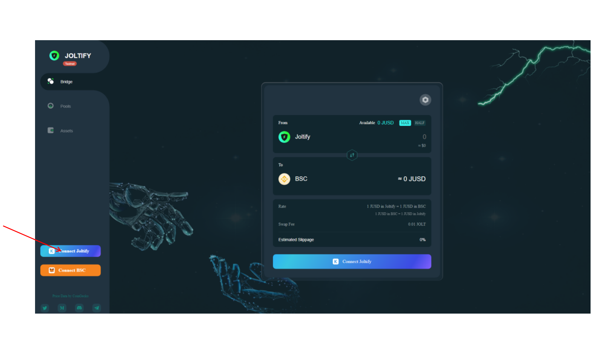
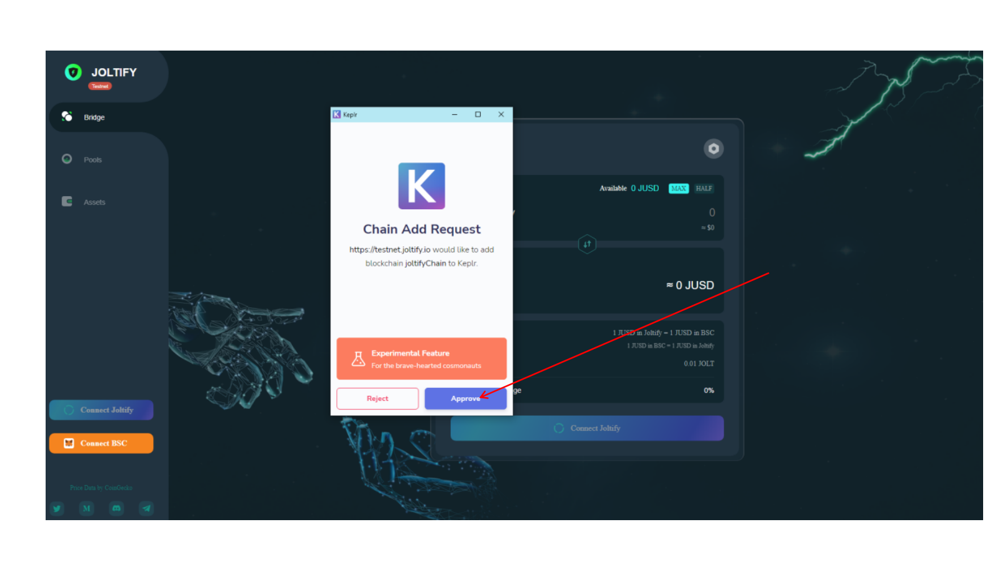
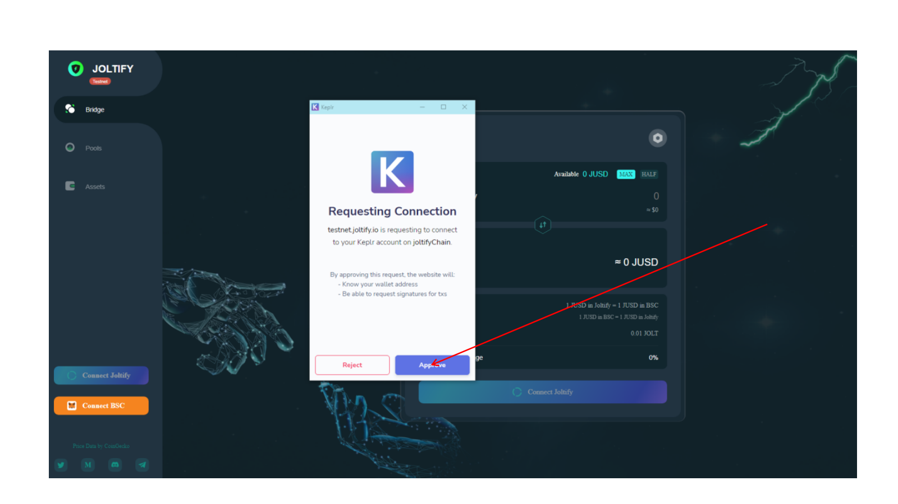
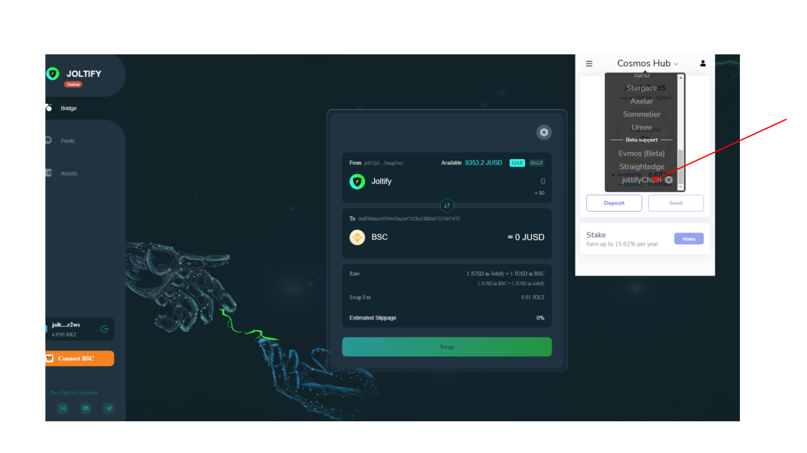

# How To Add Joltify Chain To Keplr?

**Go to https://testnet.joltify.io/ and click “Connect Joltify”**

**This page will show up, Click "Approve"**

**This page shows up, clicks “Approve” Again.**

**When the above steps are done. The Joltify Chain is automatically added to the Keplr wallet. You can check whether it is successful from your Keplr wallet.**

